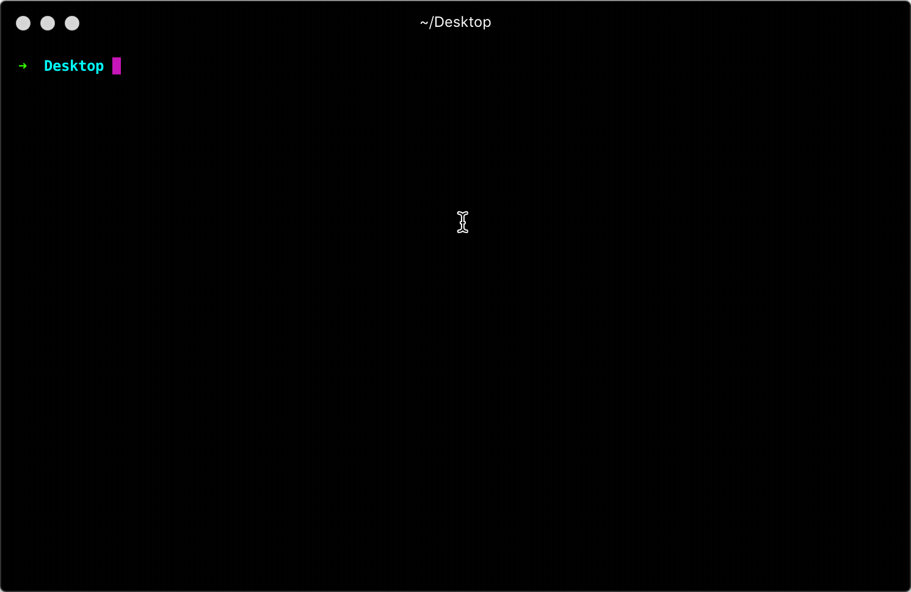
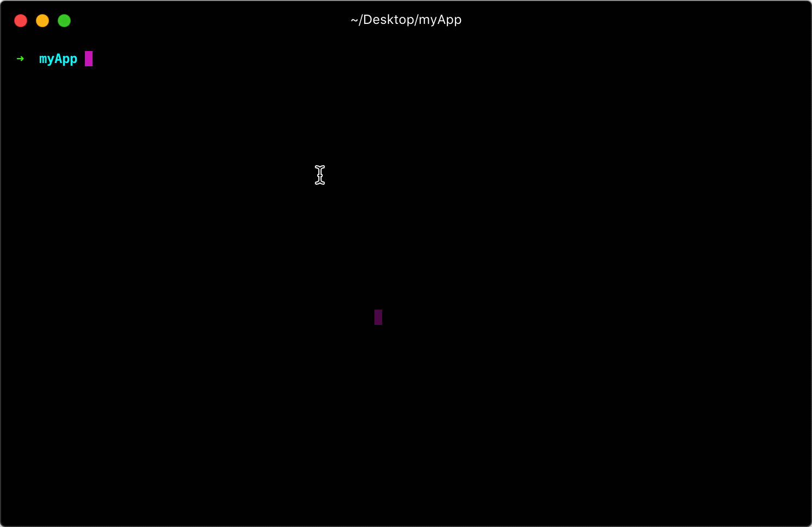
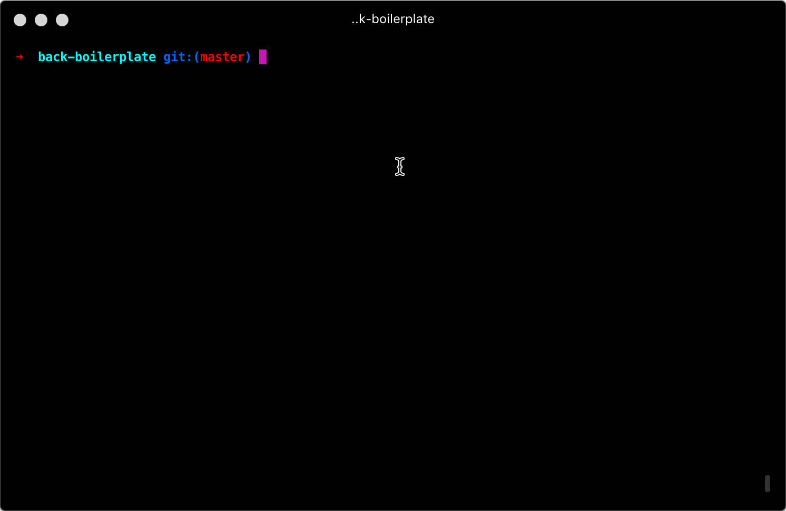

# Vobi Cli
Command line tool for Vobi Backend

### Install
Install vobi-cli
```
npm install -g vobi-cli
```

after installing `vobi-cli` you can create new project by running

```
vobi-cli new myApp
```


### Usage

Run command from project`s root folder

```
vobi-cli [method]
```

### Methods

| name | Options | description |
|------|---------|-------------|
| `generate:module` | - | Generate new module scaffolding for project|
| `create:module` | - | Include generic module into project |
| `make:seeder` | - | Make seeder scaffolding for project |
| `generate:seed` | - | Generate simple seeder file |
| `seed` | -r, -o, -e | Seed Database, `-r, --reset` clear db, `-o, --only seeder` whitelist for seed, `-e, --except seeder` blacklist for seed,  |

####  Create new module
```
vobi-cli generate:module [module name]
```




####  Import pre-installed modules
```
vobi-cli create:module [module name]
```


####  Generate new seeder class
```
vobi-cli generate:seed [seeder class name] [?model schema]
```




####  Seed database
pass `--reset` or `-r` flag to drop database and re-seed
```
vobi-cli seed --reset [config]
```

