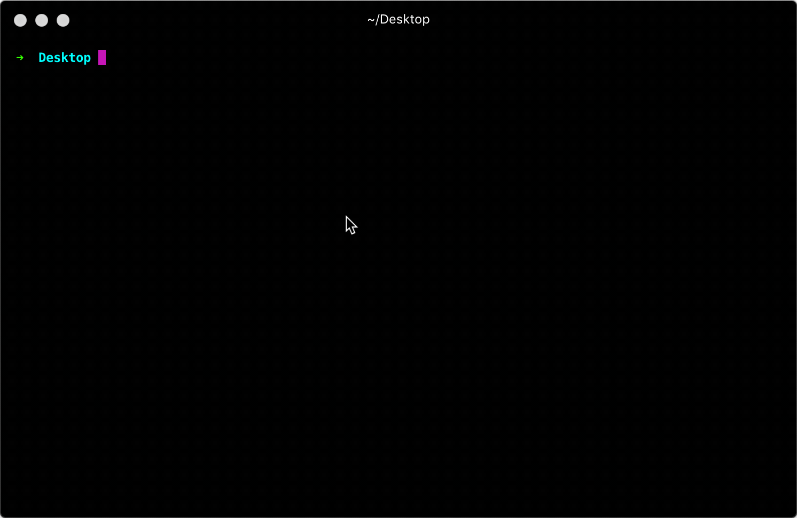

# Vobi Cli
Command line tool for Vobi Backend

### Install
Install vobees
```
npm install -g vobees
```

after installing `vobees` you can create new project by running

```
vobees new myApp
```




### Usage

Run command from project`s root folder

```
vobees [method]
```

### Methods

| name | Options | description |
|------|---------|-------------|
| `module` | - | Generate new module scaffolding for project|

####  Create new module
```
vobees module [module name]
```
